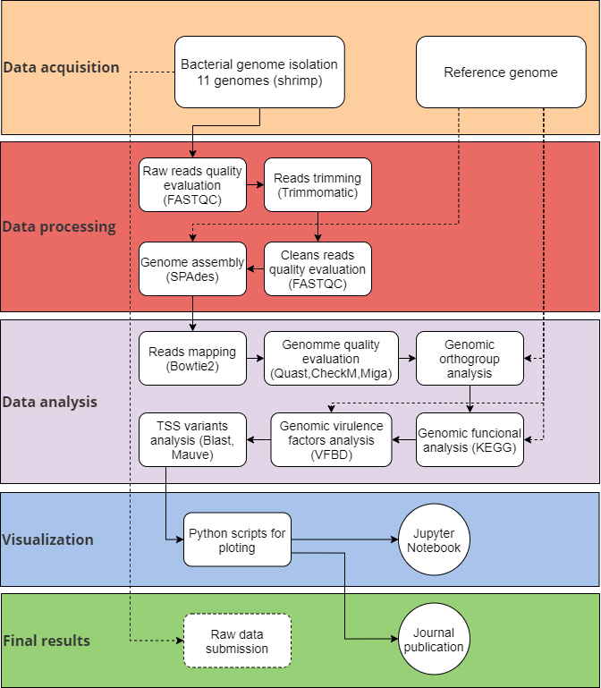

# BCEM standards for reproducible research


**Welcome to BCEM**! 

We’ve compiled this tutorial to share BCEM's reproducibility standards so that we can better document what we do, for the sake of our future selves, our collaborators, and ultimately, a world with better science. Even though reproducible standards in the field of bioinformatics go well beyond the requirements established here ([see a fully reproducible paper as an example](https://elifesciences.org/labs/ad58f08d/introducing-elife-s-first-computationally-reproducible-article)), we have decided to take things slow and adopt steps that are manageable and realistic for researchers in our group. As we grow and develop our skills, we will move in that direction, keeping those examples as a North Star. For now, let's delve into the areas we're currently covering.

## About this tutorial

This tutorial covers the following aspects around research data management:

* Project management
* Data storage
* File structure
* Naming conventions
* Shared resource usage
* Scripts conventions
* Version control

#### Project folder in the Cloud:
Every member in the lab needs to set up a project folder in a Cloud service of choice (Google Drive, OneDrive, Dropbox) in agreement with all project collaborators. This folder serves an essential purpose: to store the most important documents related to the project that will allow all parties to understand the project's developments. There is a suggested file structure and naming conventions for all files in this folder (see sections XXX and YYY, below).

#### Mind map:
At first glance, you may wonder why this step is necessary, and one of the first one in the guide. After all, you may have joined us thinking about _getting your hands dirty_ with data. But, sometimes, it is a good idea to slow down, consider where to look and what to look for. At first, it may seem that nothing is happening. In time, you'll realize this is a helpful roadmap  – one that is meant to develop with your understanding of your project and the hints you receive from your results.

The most important aspect about the mind map is that you identify the key components that will help you find answers on your objectives. Here are some guideline questions to aid that process:
* Data acquisition: How? Where? Is it an experimental project, or are you downloading the data from open databases? In either case, be very explicit on the sources of data.
* Data processing: How? Which tools? 
* Data analysis: What are the expected results? Which techniques could help me reach my goals?
* Visualization: Which results are relevant? What are resulting analysis showing?
* Final results: Where are these stored?

We suggest using a service such as[ diagrams.net](https://www.diagrams.net/) to produce the actual map. But that's not binding, you may use any one that gets you there. Ideally, at every step of the way, the mind map should be up-to-date in your project folder in the Cloud service chosen.

Here's an example for a project based on experimental data collection:

Here's an example for a project based on data acquired from public databases:



####  Metadata

This is a **mandatory** piece of documentation accompanying **all** data sets used in the project that details the source and the process of data acquisition and processing.
tos. We abide by the standards on Mininum Information about a Genome Sequence ([MIGS](https://www.ncbi.nlm.nih.gov/pmc/articles/PMC2409278/)), which are already adopted by specific repositories of genome sequence data such as the European Nucleotide Archive ([ENA](https://www.ebi.ac.uk/ena/browser/)).

Experimental:

Computational:

####  Raw Data
Raw data must be stored under our lab's ENA account _immediately_ upon receival. The guidelines for submission are as follows:

- In the case of computational results, if data generated could be useful to someone else, it should be submitted to public platform:
  - What about to [OSFHOME](https://osf.io/)?: [Chloroplast Markers Database](https://osf.io/qtz59/?view_only=538ab7719073498abfaea0ab1b29d2ba)

####  Documenting experiments and data processing
Our lab requires that any process of data acquisition and/or processing be properly documented so that the work is as transparent and reproducible as possible. There are two possibilities for this documentation process, using an Electronic Lab Notebook (ELN), specifically [RSpace](https://community.researchspace.com/login) (our Lab has a centralized account to manage multiple projects by all members with this provider), or digitally keeping detailed logs in a MarkDown (_.md_) document. Suggested tools to this end are [Jupyter](https://jupyter.org/) notebooks, [Zettlr](https://www.zettlr.com/), [Typora](https://typora.io/). The platform does not matter as long as it is a MarkDown document.

These documents _must_:

o Have one per flowchart (mind map) component
o Contain the following sections for _each entry_:
    •Date
    •Aim
    •Protocol followed
        •Command lines or methodology in the lab
        •Third-party software (description of how it was used, under what parameters, includelink to the tutorial(s))
    • Results 
        • Must include relevant tables, graphs, etc. (or links to where these are stored, in case of large files)
        • Must be commented (interpretations of what has been found)
    • Indication of where the (intermediate) data was deposited (path, link).

####  File Structure:
This is the suggested (required?) file structure for the folder ...
1. 01_Quality
2. 02_Trimming
3. 03_Quality_Trimming
4. 04_Assembly
5. 05_Results_Figures
6. 06_Results_Tables
7. 07_Manuscript

In some cases this could be organized by folders. In the case of data:

```bash
./Data/
├── README.md
├── reads_raw
│   └── <file_name>.fa
├── reads_quality
├── reads_clean
├── reads_mapping
├── genomes_quality
│   ├── CheckM
│   ├── Quast
|   └── Miga
├── genomes_anotation
├── genomes_orthologs
└── secretion_systems_shrimps
```

Or in the case of codes and scripts:

```bash
./Scripts/
├── README.md
├── Bowtie2
│   ├── log_files
│   ├── output_files
|   ├── Scripts
|   |   ├── <DataType_TypeProcessing>.sh
|   |   ├── plasmid_quality.sh
└── └── └── genomes_quality.sh
```

#####  File Naming Conventions:
These are the conventions adopted by our lab to ensure as much as possible an understanding of what is contained in a file: …

```bash
<DataType_TypeProcessing>.sh
```

#### Script Requirements

The minimum requirements for a script include:
* The name of the file must be consistent with the function implemented.
* Adapt to a standard of mnemonics and notation (Notation camel): 
    * For example: NotationCamel
* Name
* Description
* Author
* Institution
* Contact email
* Date: When was it implemented
* Help (input, output)

<u>Maybe this could be described in a README file inside the folder from which processing would be executed or folder containing the entire module:</u>

* How to run
* Requirements (codependencies) versions

There must be one README per project module
1. Version
2. Parameters
3. Information needed before
4. Order in which the script should be put
5. Data structure (input and output)
6. Dependencies (versions)
7. TYPORA
8. Results graphs (if applicable)

Here's a repository containing an example of an ideal script and its associated README file: 

####  Git repository usage
Note that this is not a requirement yet, advanced users only.
([Link to a tutorial](https://github.com/BCEM-UniAndes/git-guide.git))
1. Each _commit_ must be adequately described: consistent, without omitting
information
2. DO NOT _commit_ on incomplete or unstable versions of the script
3. Teamwork (create **n** work _branches_, work on the _branch_
that corresponds, do _merge_, do _push_)
4. Execute _push_ only on the main work _branch_.
5. Only _push_ to the master branch once ...(?)
6. Main folder will be the project with a README and a workflow 
7. Within each project there are modules and each module folder must contain a README file


> Note: !

Add text here.

