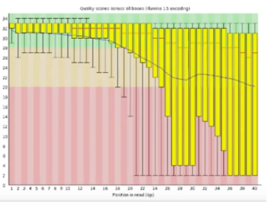

# **Notebook Example**

## **Laboratory record** 

Leda Restrepo              **/ Name** 

Shrimp intestinal microbiota evaluation  **/ Title of the project**

### **Resume of the project**

This project aims to evaluate the intestinal microbiota of shrimp using different types of probiotics. There are no studies describing what happens in the normal intestinal microbiota of shrimp. A differential improvement has been seen according to the type of probiotic used, with those containing Bacillus spp. and/or Vibrio spp. being the best. However, since several Vibrio spp. are commercially important pathogens in shrimp, there is concern that horizontal transfer may occur when probiotics are used.

-----------------------------------------------------------------------------------------------------------------------------------------------------------

**Entry # 1 - wet lab record                                February 24 2019**

**Purpose:** Shrimp pathogen challenge day 1

**Materials:** 

- **probiotics A, B, C**
- **shrimp tanks**

Today we begin the process of challenging shrimp vs pathogens. The first part of this process is the application of the different types of probiotics. We divided the whole population of shrimps in three different tanks (Tank 1, 2, 3. 50 individuals per tank), each of one will feed with one of the probiotics (A,B,C). The feeding will be at noon and morning during 1 month, with water replacement after feeding. 

The purpose of this process is to challenge shrimps with *V. parahemoliticus* by immersion process with the bacteria in order to see the microbiota of the survivors and compare it with those who died. We will extract and amplify 16s RNA.

**Note:** 

There was a small loss of color by stress in shrimps of tank 1. 

-----------------------------------------------------------------------------------------------------------------------------------------------------------

**Entry # 23 - in silico lab record**                            **May 13 2019**

**Purpose:** Shrimp metagenomic evaluation

**Materials:** 

- **Amplicon sequences of 16S RNA (Edificio B, piso 2, revco asignado BCEM, puerta 2, rac 1 y 2).** 
- **FASTQC**
- **Galaxy workflow**

Today we finally have the sequences of the amplicons in our hands. To start their analysis we will clean and check the quality of each one of them.

We used FASTQC version 0.11.7 installed on the Universidad de Los Andes cluster.

The quality was evaluated with FASTQC using the following command:

fastqc seqfile1 -o salida_calidad -f fastq

**Figure 1. Fastqc evaluation for seqfile1**

Due to the result of Figure 1, we submitted seqfile1 to a filter of quality by Filter FastQ, FastQ Trimmer and FastQ Quality Trimmer. We use it as a parameter for Filter FastQ 22 in quality. In FastQ Trimmer 2 bases and in FastQ Quality Trimmer 24. 

**Figure 2. Result after filtering for seqfile1**
