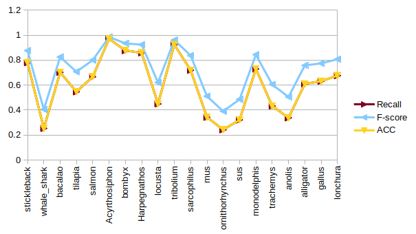
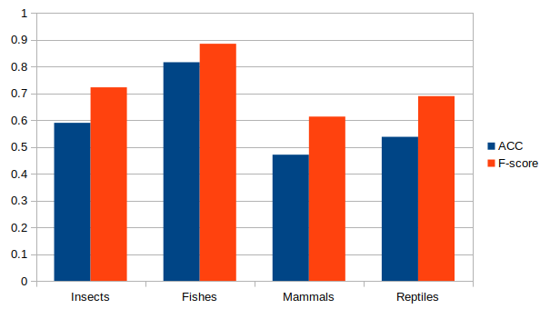

# **Notebook Example**

## **Computational process record** 

Diego Martínez            **/ Name** 

Taxonomic classification for organisms of animal kingdom based on NGS applying ML methods  **/ Title of the project**

### **Resume of the project**

The invention of new techniques for sequencing the DNA have resulted in tons of genetic information that are available to be studied and used for multiple applications. One of those applications is taxonomic classification of organisms. These type of tasks require novel and sophisticated bioinformatic methods to process and analyze all that data, which are divided in two main approaches: *barcoding* y secuenciación *shotgun*. The former demands the use of a specific molecular marker that shifts depending on the type of organisms, the latter needs to make a complex alignment process of the small reads obtained by some NGS technique. Taking this into account, the main goal of this project is to construct a computational method, using *Machine Learning*, to classify those short sequences at a high taxonomical levels, skkipng over the alignment step or the amplification os a genetic marker.

-----------------------------------------------------------------------------------------------------------------------------------------------------------

**Entry # 1 - Genomes selection (January 24 2020)**

**Purpose:** Select representative genomes from ncbi

Initially, it is necessary to select some representative genomes that will serve to construct a preliminar data base of sequences. Then this data will be fragmented in simulated NGS reads and, later, they will be employed to construct an *Machine Learning* training data set.

Genomes chosen belong to two animal groups: insects and fishes. The following table resumes the information of the genomes downloaded from [NCBI FTP Site](https://ftp.ncbi.nlm.nih.gov/):

**Table 1. Genomes of insects selected:**

|   Common name   | **Red** **flour**  **beetle** | **Pea** **Aphid**   | **Domestic** **silk** **moth** | **Migratory** **locust** | **Indian** **jumping** **ant** |
| :-------------: | ----------------------------- | ------------------- | ------------------------------ | ------------------------ | ------------------------------ |
| Scientific name | Tribolium castaneum           | Acyrthosiphon pisum | Bombyx mori                    | Locusta migratoria       | Harpegnathos saltator          |
|  Access Number  | GCF_000002335.3               | GCF_005508785.1     | GCF_000151625.1                | GCA_000516895.1          | GCF_003227715.1                |
| Estimated size  | 165.944 Mb                    | 541.415 Mb          | 397.687 Mb                     | 5759.8 Mb                | 334.537 Mb                     |
|       %GC       | 351.887                       | 296.956             | 37.8                           | 40.7                     | 44.8                           |
|    Scaffolds    | 2149                          | 21920               | 43463                          | -                        | 857                            |
| Taxonomic group | Coleoptera                    | Hemiptera           | Lepidoptera                    | Orthoptera               | Himenoptera                    |

**Table 2. Genome of fishes selected:**

| **Common** **name** | **Whale** **shark** | **Three-spined** **stickleback** | **Atlantic** **cod** | **Nile** **tilapia**  | **Atlantic** **salmon** |
| ------------------- | ------------------- | -------------------------------- | -------------------- | --------------------- | ----------------------- |
| Scientific name     | Rhincodon typus     | Gasterosteus aculeatus           | Gadus morhua         | Oreochromis niloticus | Salmo salar             |
| Access Number       | GCF_001642345.1     | GCA_006229165.1                  | GCF_000231765.1      | GCF_001858045.1       | GCF_000233375.1         |
| Estimated size      | 2931.6 Mb           | 467.452 Mb                       | 669.966 Mb           | 966.688 Mb            | 2996.89 Mb              |
| %GC                 | 41.8                | 43.4                             | 45.8                 | 40.7187               | 43.8912                 |
| Scaffolds           | 57334               | 10242                            | 227                  | 2460                  | 241573                  |
| Taxonomic group     | Chondrichthyes      | Gasterosteiformes                | Gadiformes           | Perciformes           | Salmoniformes           |

-----------------------------------------------------------------------------------------------------------------------------------------------------------

**Entry # 31 - Leave-One-Out initial results (March 15 2021)**

**Purpose:** Obtain testing results using a Leave-One-Out cross-validation process

In order to undestand the capacity of generalization of the model if we make the testing process using species different from the ones used to train, we decided use a Leave-One-Out approach to train the CNN model once again.

We used [Leave-One-Out](https://scikit-learn.org/stable/modules/generated/sklearn.model_selection.LeaveOneOut.html) function from [scikit-learn](https://scikit-learn.org/stable/index.html)

**Figure 1. Metrics per species**

**Figure 2. Metrics per class group**